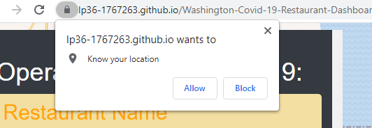
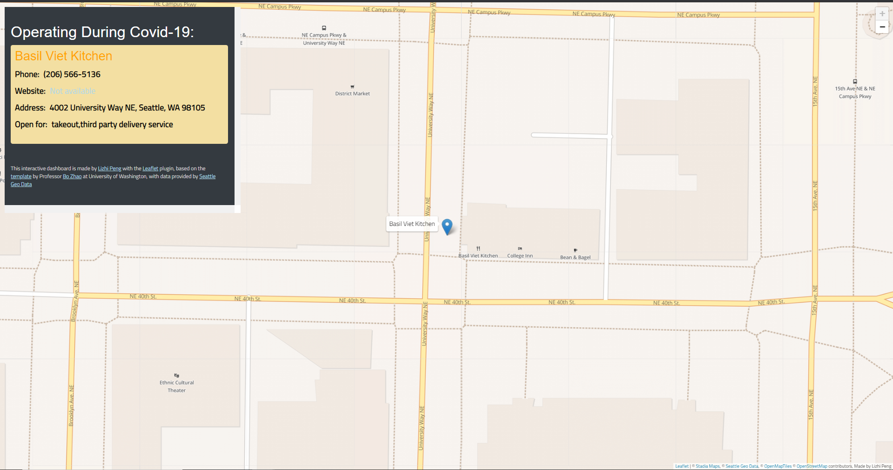
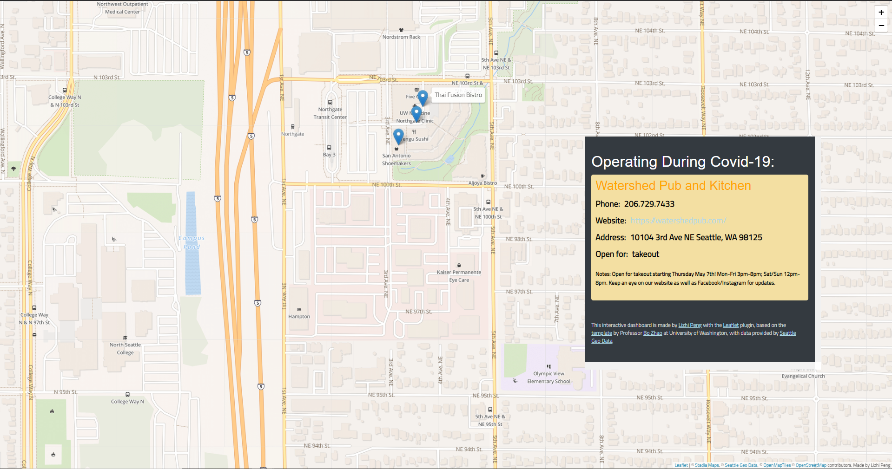

# The Covid-19 Restaurant dashboard

The Covid-19 pandemic has been going on for more than a year, following state guidelines on social distancing, most restaurants in Washington State have either closed or limited their dining options to take outs or deliveries. This interactive map displays all restaurants that are open during covid-19 within the state of Washington. The goal is to help the user find nearby restaurants and support local small businesses. This project is based on the [template](https://github.com/jakobzhao/geog458/tree/master/weeks/week06) by Professor [Bo Zhao](https://github.com/jakobzhao) from University of Washington, and uses the API provided by [Seattle Geodata](https://data-seattlecitygis.opendata.arcgis.com/) for the restaurant data. It is supported by the [Leaflet](https://leafletjs.com/) plugin and [Stadia Maps](https://stadiamaps.com).

## Usage

* The website will request to access the user's current location to help locate nearby open restaurants. This is completely optional

* Hovering over a marker shows a tooltip containing its name, clicking it zooms in on the location and displays the contact information(phone, website if available, address, dining options and any additional notes).

* The Information panel can be moved around by dragging it across the screen to avoid blocking the map.
